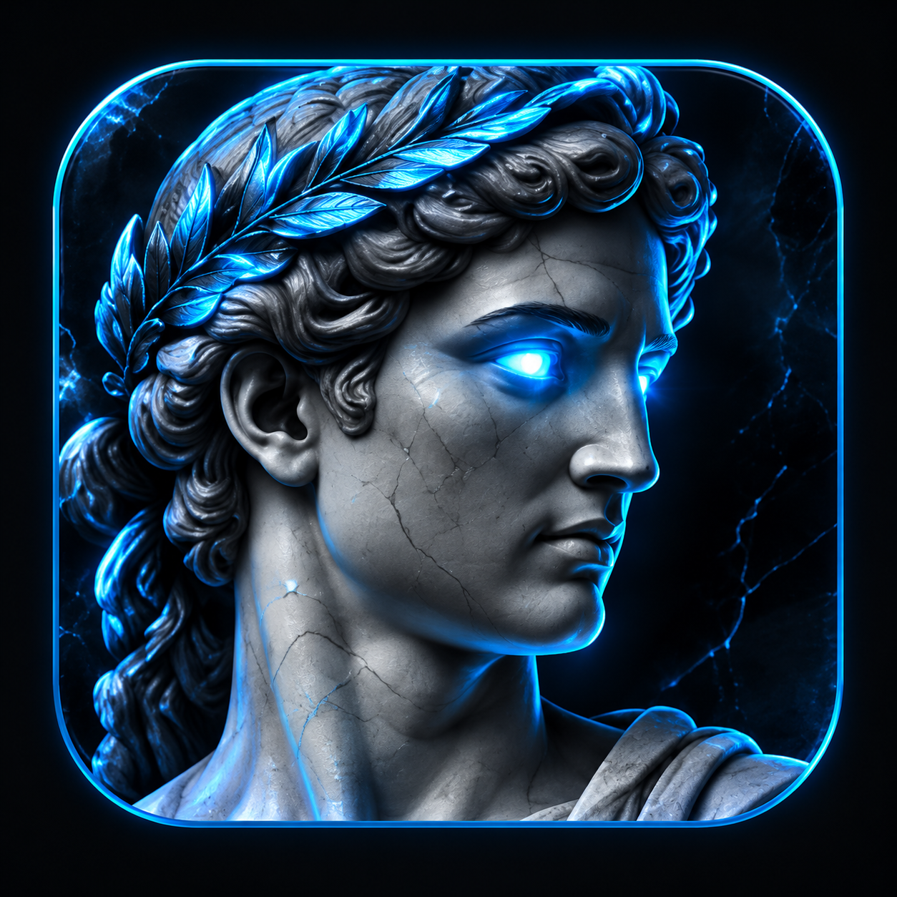
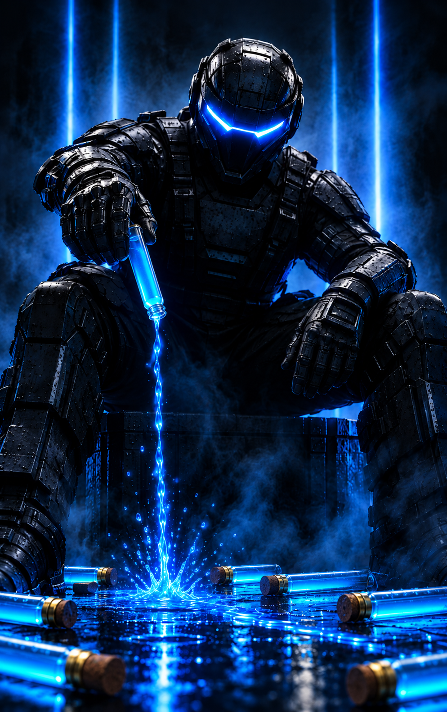

<h1>
   
  [ZXG] T7 DivinX 
  &nbsp;
</h1>

### Votre lanceur personnalisé pour Call of Duty: Black Ops III

Retrouvez vos modules, vos réglages de session et vos diagnostics dans une interface personnalisée par **STARZISMIK**.

 

 

[**Disponibilité du téléchargement**](#publication-en-préparation)
&nbsp;&nbsp;•&nbsp;&nbsp;
[**Site officiel**](https://www.zxg.fr)
&nbsp;&nbsp;•&nbsp;&nbsp;
[**Discord**](https://discord.gg/4cb3ENTXd4)

 

---

## Publication en préparation

Le téléchargement n'est pas encore disponible. Le conditionnement de l'application, la validation réseau des mises à jour et les conditions de redistribution des composants tiers restent à finaliser avant la première release.

## Présentation

Le lanceur permet de choisir entre deux modules alternatifs : le menu complet et Divinium / Marché noir. Il regroupe les réglages de session, les diagnostics et les journaux.

## Fonctionnalités

- Détection et lancement de Black Ops III.
- Choix entre le menu complet et Divinium / Marché noir.
- Chargement manuel ou automatique lorsque le jeu et son rendu sont prêts.
- Réglages de session et touche d'ouverture du menu depuis l'accueil.
- Onglets Modules et Infos, diagnostics et journaux.

Les modules sont alternatifs : redémarrer le jeu pour changer de module. Toutes les options du menu n'ont pas été testées.

## Configuration

- Windows 64 bits.
- Steam et Call of Duty: Black Ops III PC.
- Un build du jeu compatible avec les modules ; une mise à jour du jeu peut nécessiter une adaptation.

## Mises à jour

Le contrôle au démarrage est implémenté dans le lanceur, mais sa connexion au service distant et sa validation réseau restent à terminer avant distribution. Aucune installation automatique n'est annoncée.

---

## Protections : intégration partielle

Cette application n'intègre pas le T7 Patch complet et ne garantit pas une protection contre tous les exploits ni contre le piratage de compte. Les tests réalisés ne constituent pas une validation exhaustive de sécurité ou de stabilité.

## Crédits

Personnalisation : **STARZISMIK**.

Bases et travaux tiers : Scroptss / Scropts-QOL, Serious, InsaneCallum, shiversoftdev et contributeurs amont. Composants comprenant notamment Dear ImGui, MinHook et Microsoft Detours. Leurs droits et attributions sont conservés ; cette page n'accorde aucune licence supplémentaire sur ces composants.

---

## Liens

---

Personnalisé par **STARZISMIK**

**[ZXG] T7 DivinX — Version préparée 1.0.0**

© 2026 STARZISMIK — personnalisation et contributions. Droits des composants tiers conservés.

